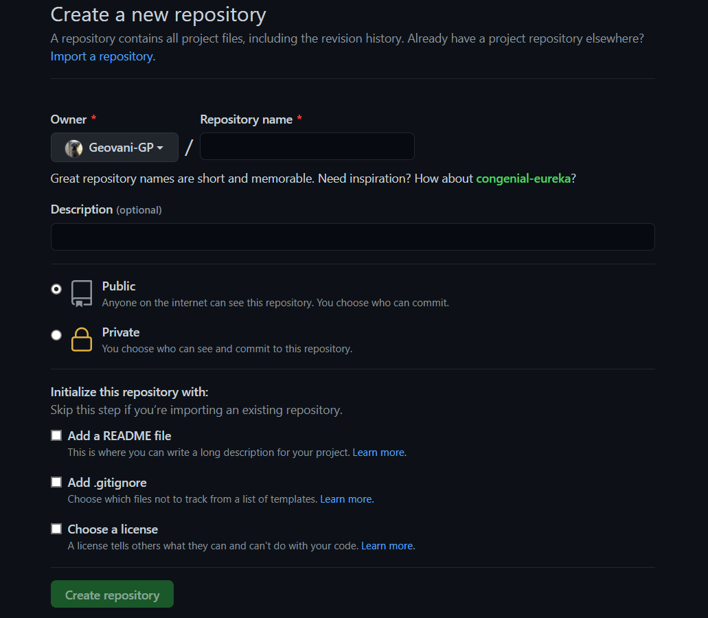

# Github
Para tener un panorama mas clara de lo que es github vamos a abordar una operativa básica del día a día del desarrollador y el trabajo con el sistema de control de versiones Git. Básicamente explicaremos los pasas para crear un nuevo repositorio en Giyhub con el código de un proyecto.

## Crear un repositorio en Github.
Desde github creas un repositorio con el boton "New" de arriba a la derecha. Obiamente tienes que haberte registrado en Github para comenzar, el registro es gratuito.


Aparece en una página para que indiques los datos del repositorio. Básicamente tienes que darle un nombre, elegir si es público o privado y opcionalmente una descripción. Yo la parte que dice "Initialize this repository with a README" siempre la dejo desmarcada. Luego comentaré algo más sobre el "README".



# Subir el proyecto a Gihub con Push.
¿Sabes lo q tienes que hacer para subir los archivos? Es fácil. No lo subes por Zip ni nada deeso, sino que usas el propio Git, el sistema de control de versiones. La operación que tienes que realizar se llama "push".

Yo lo hago desde la línea de comandos, pero hay programas de interfaz gráfica que también tehacen estos pasos quizás más fácilmente.

Posteriormente a git commit que se realizo en el documento anterior tienes q hacer el "push" desde tu repositorio local a remoto con los comandos que aparecen en la página de Github que hay justo después de haber creado el repositorio. Vuelve a tu navegador y los verás, abajo del todo, en la alternativa de subir un repositorio existente en local.

Primero debemos agregar el origen de datos donde se subira el proyecto.

```
git remote add origin https://github.com/aqui-tu-repo.gi
```

Posteriormente realizamos un push.

```
git push -u origin master
```

Posteriormente al crear un repositorio de Github te aparecen esos 2 comandos. Es bueno copiar y pegar de allí, porque aparecerá la URL de tu repositorio en GitHub y así no corres el riesgo de equivocarte al escribir.

Para acabar, o antes de subir el proyecto con push, por buenas prácticas, deberías ponerle un README.md a tu proyecto (generas el archivo en local y haces el git add . para que se agregue y luego el commit).
Ese archivo README.md tiene sintaxis Markdown, que permite escribir cosas como enlaces, encabezamientos, negritas, etc.

## Archivo .gitignore
Git tiene una herramienta imprescindible casi en cualquier proyecto, el archivo "gitignore", que sirve para decirle a Git qué archivos o directorios completos debe ignorar y no subir al repositorio de código.
Su implementación es muy sencilla, por lo que no hay motivo para no usarlo en cualquier proyecto y para cualquier nivel de conocimientos de Git que tenga el desarrollador.
Únicamente se necesita crear un archivo especificando qué elementos se deben ignorar y, a partir de entonces, realizar el resto del proceso para trabajo con Git de manera habitual.
En el gitignore se especificarán todas las rutas y archivos que no se requieren y con ello, el proceso de control de versiones simplemente ignorará esos archivos.

## Implementación de .gitignore.
Si algo caracteriza a gitignore es que es muy fácil de usar. Simplemente tienes que crear un archivo que se llama ".gitignore" en la carpeta raíz de tu proyecto. Como puedes observar, es un archivo oculto, ya que comienza por un punto ".".
Dentro del archivo .gitignore colocarás texto plano, con todas las carpetas que quieres que Git simplemente ignore, así como los archivos.
La notación es muy simple. Por ejemplo, si indicamos la línea.

```
bower_components/
```

Estamos evitando que se procese en el control de versiones todo el contenido de la carpeta "bower_components".
Si colocamos la siguiente línea:

```
*.DS_Store
```

Estaremos evitando que el sistema de control de versiones procese todos los archivos acabados de .DS_Store, que son ficheros de esos que crea el sistema operativo del Mac (OS X) automáticamente.
Hay muchos tipos de patrones aplicables a la hora de especificar grupos de ficheros, con comodines diversos, que puedes usar para poder indicar, de manera muy específica, lo que quieres que Git no procese al realizar el control de versiones.

## Eliminar archivos del repositorio si te has olvidado el .gitignore
Nos ha pasado a todos más de una vez que se nos olvida generar el correspondiente .gitignore después de haber hecho un commit. Observerás que, por mucho que estés diciendo que ahora sí quieres ignorar ciertas carpetas o rutas, éstas continúan en tu repositorio. Básicamente, ésto
es así porque estaban allí antes de informar que se debían ignorar. En los siguientes commits serán ignoradas todas las modificaciones de las carpetas en cuestión, pero lo que había antes perdurará en el repositorio.
Por ejemplo, imagina que estás en un proyecto NodeJS. Olvidas de hacer el gitignore de la carpeta "node_modules". Entonces haces un commit y metes un montón de dependencias a tu repositorio git, que no debían estar. Si ves ahora en un sistema de interfaz gráfica tu repositorio (o subiéndolo a Github) podrás observar que los archivos de "node_modules" están ahí.
Luego creas tu .gitignore con el código para node, que puede ser muy grande pero donde querrás al menos ignorar los gestores de dependencias que puedas estar usando, como por ejemplo:
```
# Código gitignore para evitar procesar los directorios de las dependencias
node_modules
jspm_packages
```
'
Nota: Las líneas que comienzan por "#" en un .gitignore son simplemente comentarios.
'

Ahora haces nuevos commits pero los archivos no se borran. ¿Qué hacer entonces?
Básicamente lo solucionas con un comando de Git llamado "rm" que básicamente funciona igual que el comando del mismo nombre que usas para borrar archivos en una consola del estilo de Mac o Linux.

```
git rm -r --cached node_modules
```

Luego tendrás que hacer un commit para que esos cambios se apliquen al sistema de control de versiones.

```
git commit -m 'Eliminada carpeta node_modules del repo'
```

A partir de ahora esa carpeta no se verá en tu repositorio y gracias a tu .gitignore tampoco se tendrá en cuenta en las siguientes operaciones que realices mediante Git.