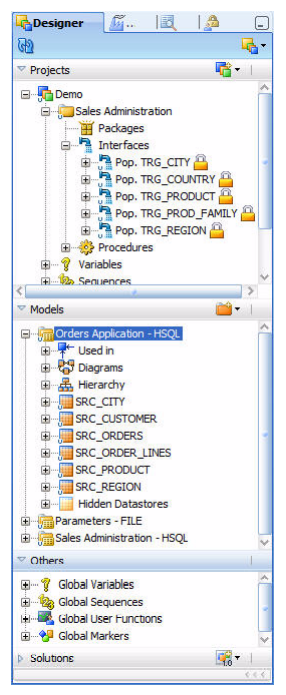

# ODI12
## ¿Que es?
Oracle Data Integrator proporciona un nuevo enfoque de diseño declarativo para definir la transofmracion de datos de procesos, lo que resulta en un desarrollo y mantenimiento más rapidos y sencillos. Basado en arquitectura E-LT (Extracció-Transformación y Carga).

ODI emplea un poderoso enfoque en diseño declarativo para los datos de integracion, que separa las reglas declarativas de los detalles de implementación

ODI elimina la necesidad de un servdor ETL independiente y de motor de propietario, en su lugar aprovecha la potencia inherente de sus motores RDBMS, como resultado proporciona la mayor productividad tanto para el desarrollo como para mantenimiento, y el ás alto rendimiento para eecucion de tranformacion de datos y procesos de validación.

### Ventajas de integración.
* Desarrollo y matenimiento más rápido y sencillo.
* Cortafiegos de calidad de datos.
* Mejor redimiento de ejecución.
* Arquitectura más simple y eficiente.
* independiencia de la plataforma.
* Conectividad de datos.
* Ahorro de costes.

## Arquitectura de Componentes ODI
La plataforma ODI se integra en la plataforma mas amplia Fusion Middleware y se convierte en un componente clave de esta pila. ODI proporciona sus componentes de tiempo de ejecición como aplicaciones JAVA EE mejoradas para aprovechar al maximo las capacidades del servidor de aplicaciones Oracle WebLogic.

### Repositorios
El componente centrar de la arquitectura es Oracle Data integrator Repository. Eso almacena información de configuración sobre la infraestructura de TI, metadatos de todas las aplicaciones, proyectos, escenarios y los registros de ejecución.
El repositorio puede coexistir en la infraestructura de TI, por ejemplo, *desarrollo, control de calidad, Aceptacion y produción* .
El repositorio tambien actúa como un sistema de control de versiones donde los objetos se archivan y se les asigna una version.

El repositorio de Oracle Data integrator está compuesto por un repositorio principal y varios repositorios de trabajo. 
Por lo general, solo hay un repositorio principal que almacena la siguiente información:
    * Información de seguridad que incluye usuarios, perfiles, derechos para la plataforma ODI.
    * Información de topologia que incluye tecnologias, definiciones de servidor, esquemas, contextos, idiomas, etc.
    * Objetos versionados y archivados.

El repositorio de trabajo es el que contiene los objetos desarrollados realies. Los repositorios pueden coexistit en la misma instalacion de ODI(por ejemplo: para tener entornos separados o para que coincida con un ciclo de vida de versiones en particular). Un repositorio de trabjao almacena información para:
    * Modelos, incluida la definicion de esquema, estructuras de almacenes de datos y metadatos, campos y definiciones de columnas, restricciones de calidad de datos, referencias cruzadas, linaje de datos, etc.
    * Proyectos, incluidas reglas comerciales, paquetes, procedimientos, carpetas, conocimientos, moodulos, variables,etc.
    * Ejecución de escenarios, incluidos escenarios, información de programacion y registros.
    
Cuando el repositorio de trabajo contiene solo la información de ejecucion(normalmente para fines de producción), se denomina Repositorio de ejecucion.

## Instalación de ODI

## Trabajar con proyecto ETL

   * El repositorio (the Repository): contiene todos los metadatos necesarios para los ejemplos de formación, está alojado, a estos efectos de evaluación, en una base de datos.
   * Solicutud de pedidos (Orders Application): Una aplicación para rastrear los pedidos de los clientes, alojada en una base de datos suministrada.
   * Parametros (archivo-File): Archivos planos (ASCII).
   *Administración de ventas (Sales Administration): La administracion o seguimiento de ventas, alado en otra base de datos suministrada. Este almacén de datos es poblado de nuestras transformaciones.
   
## Uso de los navegadores ODI
ODI Studio proporciona cuatro navegadores para gestionar los diferentes aspectos y pasos de un proyecto de integracion ODI:
* Navegacion de diseñador: Se utiliza para gestionar metadatos, diseñar comprobaciones de integridad de datosy  para construir transformaciones.

    Los principales objetos que se manejan a traves de DEsigner Navigator son modelos y proyectos.
    * los modelos de datos para sus aplicaciones contienen todos los metadatos de sus datos de servidores (Tablas, columnas, restricciones, descripciones, referencias cruzadas, etc.)
    * Los proyectos contiene todas las reglas de carga y transformacion para sus datos de servidores (Interfaces, procedimientos , viables, etc.).
    
 
    
Designer Navigator tiene los siguientes acordeones:
* Proyectos: contiene los desarrollos realizados con DEginer Navigator.
* Modelos: contiene las descripciones de los datos y estructuras de aplicaciones.
* Otros: contiene las funciones de usuarios globales, variables, marcadores y secuencias.
* Soluciones: contiene las solucines que se han creado cuando trabaja con la gestion de versiones.