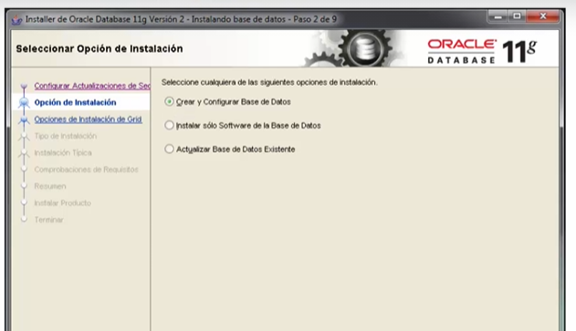
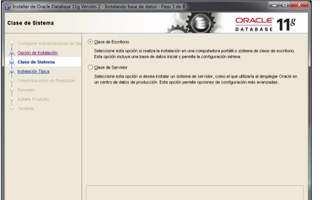
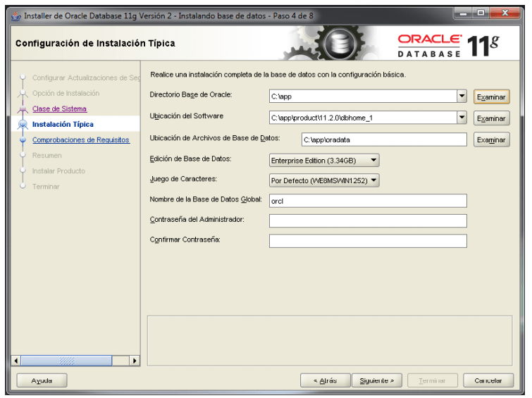
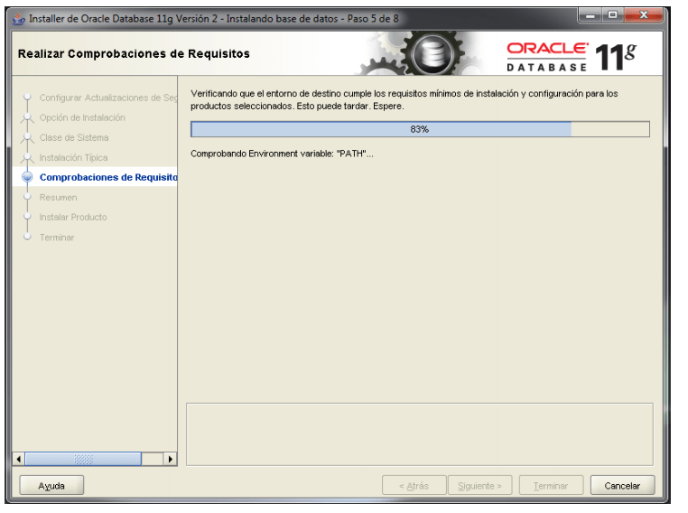
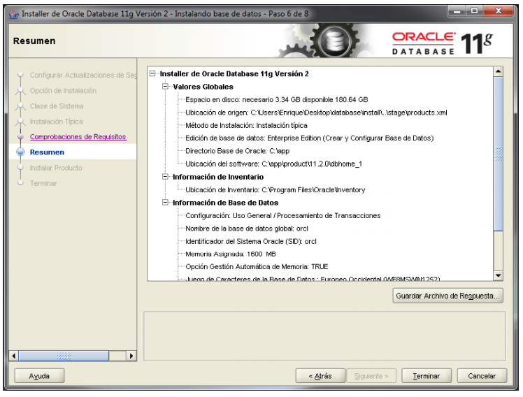
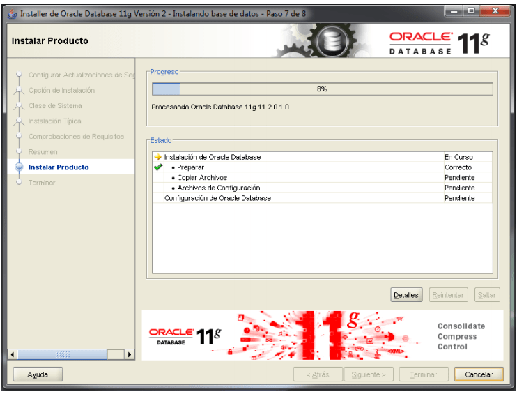
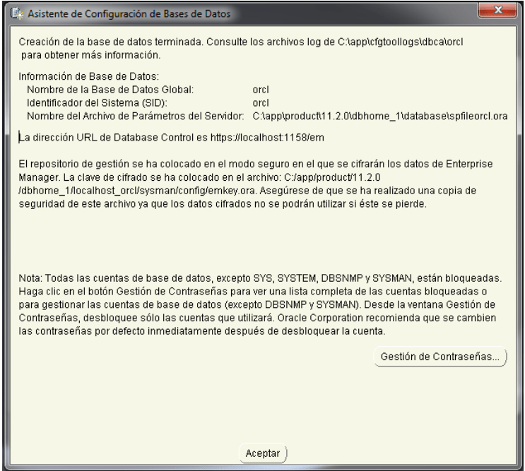
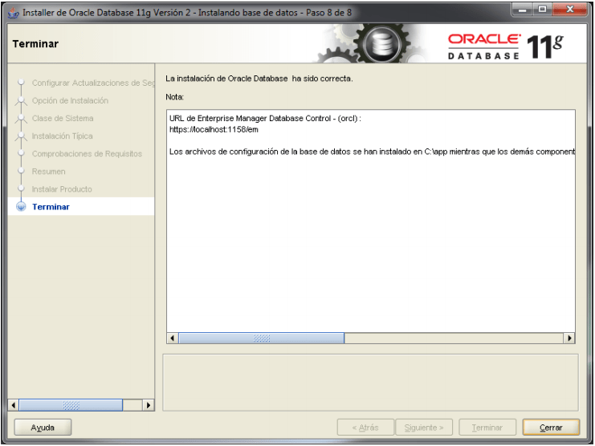

# Instalación Oracle

1. En la pagina de oracle, descargar el archivo OracleXE112
 ```text
https://www.oracle.com/mx/database/technologies/xe-downloads.html
```

2. Extraer los archivos e iniciar el archivo setup.exe, seguir las instrucciones del wizard de instalación.

    2.1 Ingresamos el correo electrónico.
    
    
    
    2.2. Seleccionar Crear y Configurar Bases de Datos
    
      
    
    2.3 Seleccionar Clase de Escritorio
    
    
    
    2.4 Ingresar la configuración basica de la base de datos
    
    
    
    2.5 Esperar a que terminen las comprobaciones del sistema
    
    
    
    2.6 Seleccionar Terminar para finalizar la configuración.
    
    
    
    2.7 Esperar que termine la instalación.
    
    
    
    2.8 Pantalla del asistente de configuración de bases de datos
    
    
    
    2.9 Finalización de la base de datos
    
    

