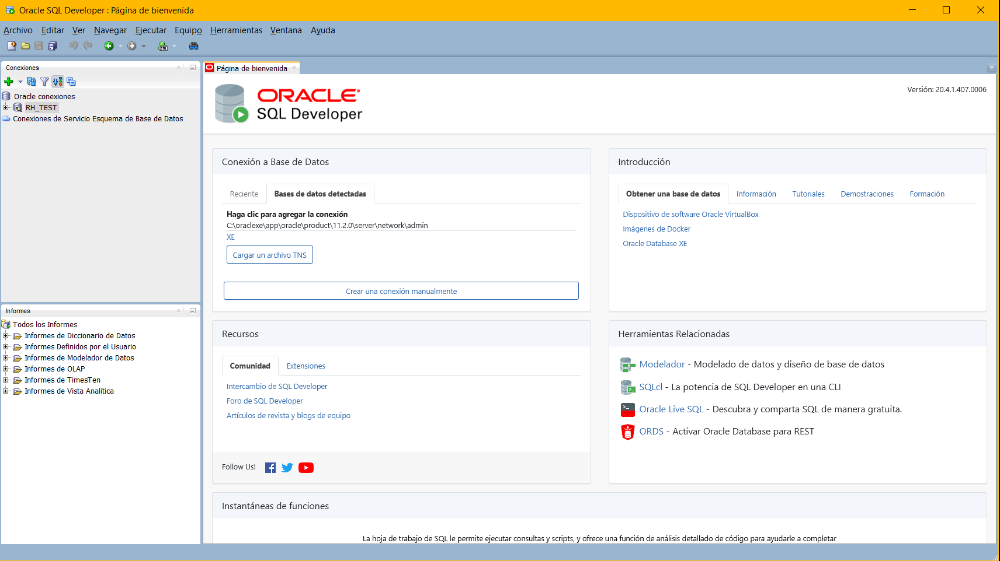
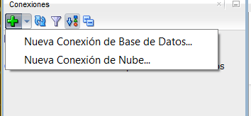
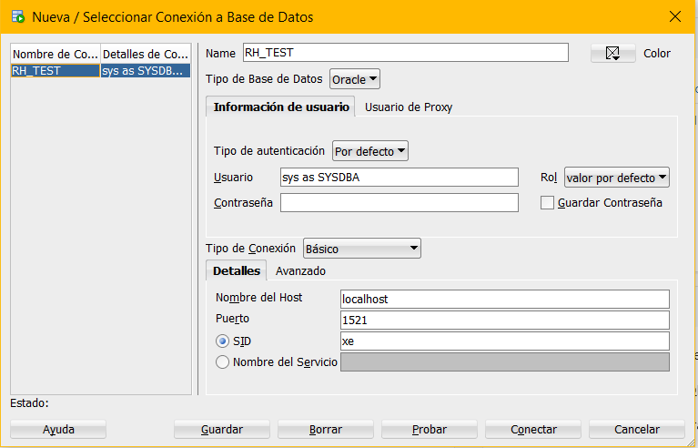
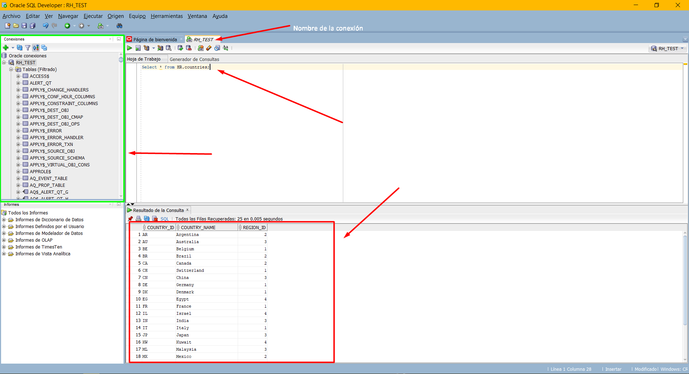

# SQL Developer.
Desde la pagina de oracle, nos dirigimos a la pagina de descargas de herramientas https://www.oracle.com/tools/downloads/sqldev-downloads.html

Seleccionamos el sistema operativo y arquitectura, cabe mencionar que se necesita el JDK de Java.

El archivo descargado es un .zip que contiene el software, descomprimimos el archivo, dentro de la carpeta extrauda encontraremos un ejecutable sqldeveloper, no es necesaria la instalación.

El primer paso es crear una conexión.

Damos click en el signo mas de color verde/Nueva conexión de bases de datos.

Realizamos la conexion con la cuenta de ejemplo desbloqueada hr

una vez realizada la conexión, podemos acceder mediante la conexion o en la parte superior seleccionando la conexión.

Ejemplo y visualizacion de entorno
